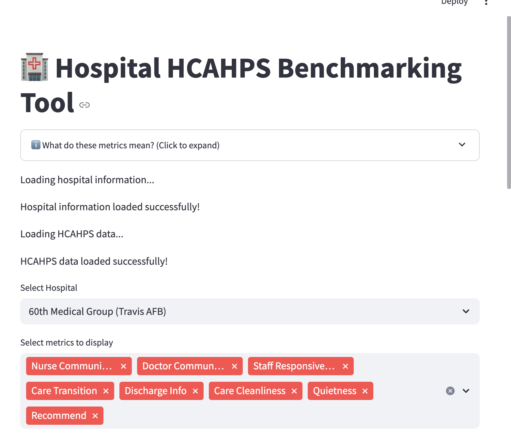

# 🏥 Hospital HCAHPS Benchmarking Tool

An interactive Streamlit web app for benchmarking hospital HCAHPS (Hospital Consumer Assessment of Healthcare Providers and Systems) survey results.

This tool allows users to compare a hospital’s patient experience metrics to state and national averages, visualize performance gaps, and export a professional PowerPoint report for presentations.

 
##  Features

*  Interactive dashboard to compare hospital vs. state vs. national HCAHPS scores
*  Select key patient experience metrics to analyze
*  Visual bar charts with labeled values
*  Download a **PowerPoint report** with a formatted table and chart
*  Simple, user-friendly interface
*  Works with publicly hosted CSV data from Dropbox (no local data upload required)

## Getting Started

1️⃣ Clone the repository:

```
git clone https://github.com/YOURUSERNAME/hospital-benchmark-tool.git
cd hospital-benchmark-tool
```

2️⃣ Create a virtual environment and activate it:

```
python3 -m venv venv
source venv/bin/activate  # (on Windows: venv\Scripts\activate)
```

3️⃣ Install required packages:

```
pip install -r requirements.txt
```

4️⃣ Run the Streamlit app:

```
streamlit run streamlit_app.py
```

Then open the app in your browser at [http://localhost:8501](http://localhost:8501).

## 📝 How it works

* Pulls **hospital info and HCAHPS survey results** from Dropbox-hosted CSV files
* User selects a hospital and metrics from dropdown menus
* Generates a **comparison table** and **bar chart** showing the hospital’s performance
* Highlights areas where the hospital is above or below benchmarks
* Option to **export a PowerPoint report** including the table and chart

## Technologies Used

* Streamlit – Web app framework
* Plotly – Visualization
* Pandas – Data manipulation
* python-pptx – PowerPoint generation

## Example Output




## 📝 Notes

* To deploy publicly, upload the app to **Streamlit Cloud** or another hosting service.
* Current data sources are Dropbox links; you can replace them with your own hosted CSVs if needed.
* Tested on Python 3.11.

## 💬 Contact

Developed by **Ravi Suresh**

📧 Email: [ravikirans723@gmail.com](mailto:ravikirans723@gmail.com)

Feel free to reach out with questions or collaboration opportunities!


